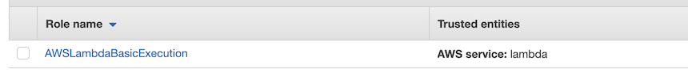
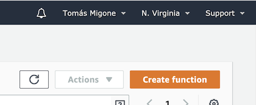
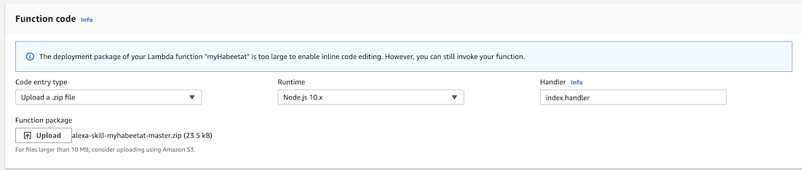

# alexa-skill-myhabeetat

Alexa skill that lets you control MyHabeetat devices, including BGH Smart Control.

### Disclaimer
⚠️⚠️⚠️This project is in no way official, endorsed or associated with or by Solidmation/MyHabeetat/BGH ⚠️⚠️⚠️

Unfortunately this means I can not submit the skill to the Alexa Skills Store on their behalf, and none of the involved parties seem to be interested in doing it either. 
You can get around that by creating your own development skill, which will only be available for your account (it's what I'm currently using and it works like a charm). See [Installation](#Installation) instructions below for a detailed step by step.

### MyHabeetat vs BGH Smart Control
This skill implements integration with [MyHabeetat's](https://myhabeetat.solidmation.com/login.html) cloud platform which allows among other things to control BGH Smart Control devices.
This skill **has not** been tested to work with [BGH Smart Control's](https://bgh-services.solidmation.com/control/LoginPage.aspx) cloud platform.
Both platforms were developed by the same company and are essentially the same but MyHabeetat allows for adding more devices. If you have your devices registered under the BGH Smart Control's platform or smartphone app please consider migrating to MyHabeetat's platform/app.

# Usage
Accepts the following standard [Thermostat](https://developer.amazon.com/en-US/docs/alexa/device-apis/alexa-thermostatcontroller.html#utterances) commands:

**Turn on**
Utterance: `Alexa, turn on <device>`
*Initially set to `auto` mode when turned on*

**Turn off**
Utterance: `Alexa, turn off <device>`

**Set temperature**
Utterance: `Alexa, set <device> to <temperature>`
*Sometimes Alexa replies with `<device> is not responding` even though the command is successfully executed. See #1 for details*

**Set mode**
Utterance: `Alexa, set <device> to <mode>`
Available modes: `heat`, `cool`, `auto`

Other commands might also work but are untested, feel free to PR or let me know and I'll add them here.

# Installation

## Overview

The process of installing your own custom skill is not as simple as installing one from the Skills Store so I added this installation section to hopefully guide you throughout the way. 
You don't really need to have programming skills or be very tech savvy to get it up and running, anyone can do it. What you do need is to pay close attention to each step as one misconfiguration can be difficult to trace or debug. Feel free to reach out if you run into any trouble and I'll be happy to assist you; to do so, please open an issue [here](https://github.com/tmigone/alexa-skill-myhabeetat/issues) or send me an email at `tomasmigone@gmail.com`.

There are two distinct pieces we need to create and configure to get our skill working:
- Alexa Custom Skill: Integration with Alexa ecosystem.
- AWS Lambda Function: Backend code that interacts with MyHabeetat's cloud platform.

## Step 1: Alexa Custom Skill

Custom skills allow you to create an Alexa skill that follows the Alexa protocol, endpoints and utterance model but that relays command execution to other services, in this case a Lambda function. 

Before we start, create or sign in to your [Alexa developer](https://developer.amazon.com/alexa/console/ask) account. Remember this skill will be treated as a development skill, only accesible to your account, so make sure you use the same account you connected to your Alexa devices.

### Create custom skill
To create your custom skill:

1. Navigate to the [Alexa developer](https://developer.amazon.com/alexa/console/ask) console.
2. Click `Create skill`.
3. Enter the skill name (for example: `My Habeetat`), select `Smart Home` as the skill model and `Provision your own` as the skill hosting. Click `Create skill` in the top right corner.
4. Choose `Start from scratch` as the template and click `Choose` to move to the next screen.
5. Navigate back to the [Alexa developer](https://developer.amazon.com/alexa/console/ask) console. Click on `View Skill ID` below your Skill and copy the the Skill ID. It should look like this: `amzn1.ask.skill.1a2b55555-c325-1234-d56e-1f234d5e6a78`.

We'll go back to the skill configuration, but before we need to create the Lambda function.

## Step 2: AWS Lambda Function

The code that interacts with MyHabeetat's platform is hosted as a Lambda function on AWS. AWS Lambda is a service that lets you run code in the cloud without managing servers. Alexa sends your skill requests and your code inspects the request, takes any necessary actions such as communicating with the device cloud for that customer, and then sends back a response.

Before we start, create or sign in to your [AWS account](https://console.aws.amazon.com/).

### Create IAM Role
First we need to create an IAM (Identity and Access Management) role that enables basic execution for our lambda function. 

1. Navigate to the [IAM](https://console.aws.amazon.com/iam/home?#/home) console.
2. Click `Roles` on the sidebar.
3. Click `Create role`.
4. Select `AWS service` as type of trusted entity and then `Lambda` as use case. Click `Next`.
5. Search for `AWSLambdaBasicExecutionRole`, select it with the checkbox and click `Next`.
6. Click `Next` as we won't be adding any tags.
7. Enter a name the identifies this role (for example: `AWSLambdaBasicExecution`) and click `Create role`.

You should now see the role you created in your IAM console:

### Create Lambda function
Next we will be creating the Lambda function that will run our code.

1. Navigate to the [Lambda](https://console.aws.amazon.com/lambda) console. 
2. Ensure that your region is set to `US East (N. Virginia)us-east-1`:

3. Click `Create function`.
4. Select `Author from scratch`. Under `Basic information` give it a name (for example: `myHabeetat`) and select `Node.js 10.x` as runtime. MyHabeetat uses an old TLS version that is no longer supported as default in `Node.js 12.x`. Lastly, under `Permissions` expand the dropdown, choose `Use an existing role` and select the IAM role we created in the previous step. Click `Create function` to continue.
5. Under `Designer` section click `Add trigger`. Select `Alexa Smart Home` as the trigger source and paste the Skill ID you copied after we generated the skill. Click `Add`.
6. Download a copy of this repository from [here](https://github.com/tmigone/alexa-skill-myhabeetat/archive/master.zip).
7. Under `Designer` click on the block that represents your lambda function. Under `Edit code inline`, select the `Upload a .zip file` option and upload the ZIP you just downloaded:

8. Scroll down a bit and under `Basic settings` click `Edit`. Change the `Timeout` value to `6 seconds` and hit `Save`.
9. Click `Save` (again) on the top right corner of your screen. Ensure the ZIP you uploaded is still there.
10. Copy the `ARN` string that is located on the top right corner. It looks like this: `arn:aws:lambda:us-east-1:901579287795:function:myHabeetat`. 

## Step 3: Alexa Custom Skill configuration
Next up is to finish off the skill configuration.

1. Navigate back to the [Alexa developer](https://developer.amazon.com/alexa/console/ask) console.
2. Click on your skill to access it's configuration.
3. You should now be at the `Build` configuration section. If you are not, click on the `Build` tab. 
4. Select `v3` as the `Payload version`. Paste the `ARN` you copied from the Lambda function into the `Default endpoint` box. Check the the `North America` box and paste the `ARN` in there too. Click `Save`.
5. Click on `Account linking`, fill in the following information and click `Save`:

| Option | Value |
| --- | --- |
| Authorization URI | `https://myhabeetat.tmigone.com/v1/oauth/authorize` |
| Access Token URI | `https://myhabeetat.tmigone.com/v1/oauth/access_token` |
| Client ID | `alexa-myhabeetat` |
| Secret | `<anything-you-want>` |
| Authentication schema | `HTTP Basic` |
| Scope | Add `default` |

This makes use of a series of OAuth 2.0 services (`https://myhabeetat.tmigone.com`) I developed to make account linking work. They are deployed using a public [Zeit Now](https://zeit.co/) project so you can review the source code through their website (`https://myhabeetat.tmigone.com/_src`) or at the project repository (`https://github.com/tmigone/myhabeetat-api`).

## Step 4: Install the Skill on your Alexa app
Last step is to install the development skill we just created on our smartphone.

1. Open the Alexa app ([Android](https://play.google.com/store/apps/details?id=com.amazon.dee.app&hl=en) / [iOS](https://apps.apple.com/us/app/amazon-alexa/id944011620)).
2. Go to `Skills & Games` tab.
3. Go to `Your Skills` and select `Dev` skills.
4. You should now see your custom skill listed and available to install with a red warning that reads `Account linking required`.
5. Open the skill, click `Enable to use`.
6. Log in with your [MyHabeetat](https://myhabeetat.solidmation.com/login.html) credentials and follow the rest of the wizard through the end.

Congratulations! You can now ludicrously control your devices with voice commands!